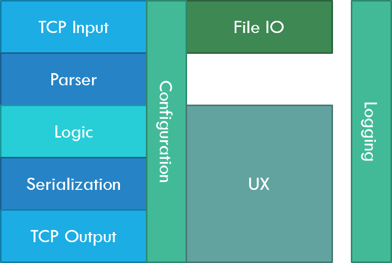

# Game Architecture

## Layers
The game consists of different layers serving different functionalities.  

### TCP Input Layer
Handles input from tcp connection and provides received data as strings.  

### Parser Layer
All strings are parsed and, message objects corresponding to each string received via TCP Input Layer are created.  

### Logic Layer
Messages and the current state of the world (which consists of tanks, water, brick walls, stone walls etc.) are merged in such a way that the new state of the world is created.  
The new state and the received message and the events happened in the history are combined to produce an output to be sent to the Game Server.  

### Serialization Layer
Output message is converted to a string using the notation recognizable by the server.  

### TCP Output Layer
The processed string is sent to the server via TCP.  

### File I/O Layer
This layer is used to load/save the configuration file via file IO.  

### Configuration Layer
This layer is used to convert the configuration file to/from an object. i.e.: Serialize configuration in order to save it into a file; Deserialize configuration from a file and provide a simple interface to be used by the rest of the program.  
This layer is accessible by all other parts of the **Astute** client.  

### UX Layer  
Graphical user interface and the processing that is needed to render the grid and etc. are provided by this layer.  

### Logging Layer
Provides basic functionality for logging everything for the sake of debugging. 

  
